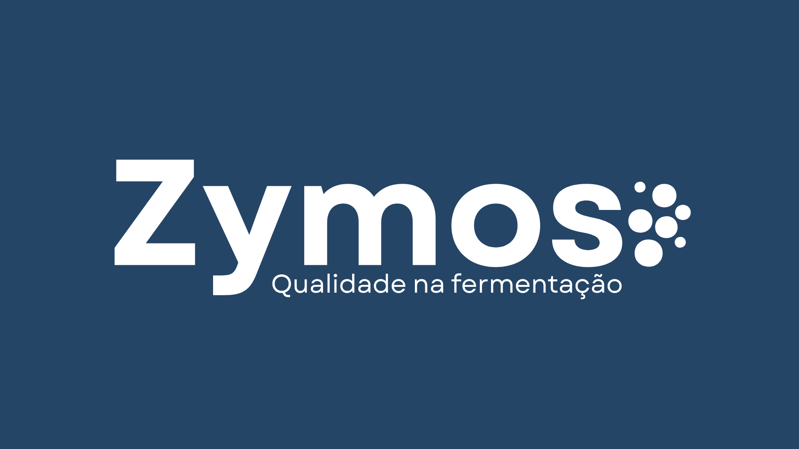

# ZYMOS: qualidade na fermentação

## Sobre o projeto
Este projeto consiste em um sistema de monitoramento automatizado de temperatura em tempo real projetado para a etapa de fermentação de cervejas do tipo Ale e Lager.
Sendo a fermentação a fase mais longa e crítica da produção cervejeira, responsável por cerca de 70% do tempo total do processo, a estabilidade térmica é fundamental.
Como as leveduras são altamente sensíveis a variações de temperatura, qualquer oscilação pode causar o adormecimento ou a desnaturação dos microrganismos, resultando em travamento da fermentação (Stuck Fermentation) e falhas sensoriais (off-flavors).

O objetivo do sistema é garantir o controle rigoroso da temperatura, eliminando gargalos logísticos, evitando perdas financeiras e assegurando a padronização e qualidade do produto final. 

## Tecnologias e Ferramentas Utilizadas

- Javascript
- HTML5
- CSS3
- VS Code
- Figma / Canva
- Trello / Word
- Sensor Arduíno LM35

<small> Este projeto possui fins acadêmicos. </small>
